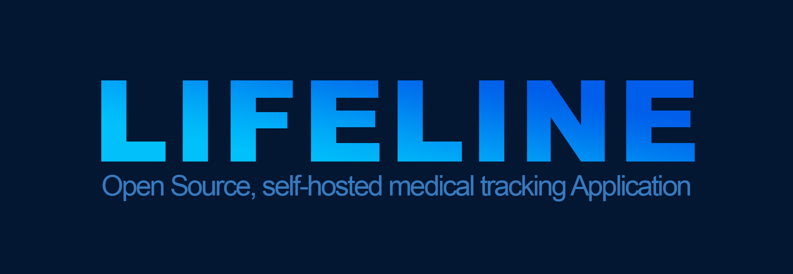

# LifeLine
**Family Health Tracking Application**

LifeLine is a comprehensive web application designed to help families manage their health. Track medications, log illnesses, store medical documents, schedule appointments, and get AI-powered medical assistance—all in one place. The application was developed for the purpose of a university course, was deployed to a DigitalOcean instance and, as of 15th Mar 2026, can be downloaded and executed on a local machine (with options to include AI assistance as well locally).

LifeLine helps you:
- Add and manage health profiles for your entire family
- Track medications, quantities, and expiration dates
- Record when medications are taken and by whom
- Keep a history of illnesses for each family member
- Upload and store prescriptions, lab results, etc. to Google Drive
- Schedule medical events on a dedicated Google Calendar
- Chat with an AI that knows your medical history (RAG-powered)
- Receive AI-generated summaries when uploading documents

**Tech Stack:**
- **Frontend**: React 19, Vite, React Router 7
- **Backend**: Python 3.11, FastAPI, Pydantic
- **Database**: PostgreSQL with PGVector extension
- **Auth**: Google OAuth 2.0 + JWT
- **Integrations**: Google Drive, Google Calendar, N8N, Gemini AI

For detailed architecture documentation, see [PROJECT_INFRASTRUCTURE.md](./PROJECT_INFRASTRUCTURE.md).

## Self-Hosting Guide

For self-hosting, follow these steps to deploy all components. It's a bit of a process, so take your time

### Prerequisites

- **Node.js 18+** and npm (for frontend development)
- **Python 3.11+** (for backend development)
- **PostgreSQL 14+** with PGVector extension
- **Google Cloud Console** account (for OAuth and APIs)

### Step 1: Clone the Repository

This is a monorepo project, so both the backend and frontend are structured within this repository.

```bash
git clone https://github.com/hajruuudin/life-line
cd life-line
```

### Step 2: Set Up PostgreSQL Database

You can use a local PostgreSQL instance or a cloud provider like Supabase. The only important thing is to name the database as "life-line" since that is the name used within the database migrations. Migrations are handeled by alembic.
In case alembic does not work, the full schema is available under /database/schema.sql

### Step 3: Configure Google Cloud

1. Go to [Google Cloud Console](https://console.cloud.google.com/)
2. Create a new project (or select existing)
3. Enable these APIs:
   - Google+ API
   - Google Drive API
   - Google Calendar API
4. Go to **Credentials** → **Create Credentials** → **OAuth 2.0 Client ID**
5. Configure the OAuth consent screen
6. Add authorized redirect URIs: `http://localhost:4200/auth/google/callback`
7. Save your **Client ID** and **Client Secret**

### Step 4: Set Up Environment variables

For the backend, the environment includes setting up the Google Cloud Project credentials, Database URL and the N8N and AI features and their status (weather they are turned off or on)

Copy the env.example file and name it .env within the root of the backend directory. Edit `.env` with your configuration based on the instructions inside the example file.

**Run locally:**
```bash
# Create virtual environment
python -m venv venv
source venv/bin/activate  # On Windows: venv\Scripts\activate

# Install dependencies
pip install -r requirements.txt

# Run database migrations
alembic upgrade head

# Start the server
uvicorn app.main:app --reload --port 8080
```

The API will be available at `http://localhost:8080` with documentation at `/docs`.

For the frotnend, the environment setup includes placing the backend url (defaults to http://localhost:8080) as well as indicating weather the two AI features are turned on or off.

Copy the env.example file and name it .env within the root of the frotnend directory. Edit `.env` with your configuration based on the instructions inside the example file.

```bash
cd frontend

# Install necessary dependencies
npm i

# Run the frontend
npm run dev
```

### Optional: Set Up N8N (AI & Automation)

N8N powers the AI chatbot and email automation features. This is optional as the main functions of the application can run without this. if You opt not to use this, please either comment out or remove the applications implementation of the Chatbot Widget, as it might break the UI.

**Option A: Self-hosted with Docker**
```bash
docker run -d \
  --name n8n \
  -p 5678:5678 \
  -v n8n_data:/home/node/.n8n \
  -e N8N_BASIC_AUTH_ACTIVE=true \
  -e N8N_BASIC_AUTH_USER=admin \
  -e N8N_BASIC_AUTH_PASSWORD=your-password \
  n8nio/n8n
```

**Option B: N8N Cloud**
Sign up at [n8n.io](https://n8n.io) for a managed instance.

**Import the workflow:**
1. Open your N8N instance
2. Go to **Workflows** → **Import from File**
3. Import `n8n-script/n8n-workflow.json`
4. Configure credentials:
   - **PostgreSQL**: Your database connection (for PGVector and chat memory)
   - **Gmail OAuth2**: For sending email summaries
   - **Google Gemini API**: For AI responses
   - **HuggingFace API**: For text embeddings

**N8N Workflow Features:**
- 📄 **Document Summary**: When files are uploaded, AI summarizes them and emails you
- 🧠 **RAG Chatbot**: AI assistant with access to your uploaded medical documents
- 💬 **Chat Memory**: Conversation history stored in PostgreSQL

## 📁 Project Structure

```
life-line/
├── backend/                    # FastAPI application
│   ├── app/
│   │   ├── controllers/        # API endpoints
│   │   ├── services/           # Business logic
│   │   ├── dao/                # Database access
│   │   ├── models/             # Pydantic schemas
│   │   └── utils/              # JWT, auth helpers
│   ├── alembic/                # Database migrations
│   ├── tests/                  # Unit tests
│   ├── Dockerfile              # Container config
│   └── requirements.txt        # Python dependencies
├── frontend/                   # React application
│   ├── src/
│   │   ├── components/         # UI components
│   │   ├── pages/              # Route pages
│   │   ├── services/           # API client
│   │   └── __tests__/          # Component tests
│   ├── tests/                  # E2E tests (Playwright)
│   └── package.json            # Node dependencies
├── database/                   # Schema exports
├── n8n-script/                 # N8N workflow JSON
├── PROJECT_INFRASTRUCTURE.md   # Detailed architecture docs
└── README.md                   # This file
```

## Additional Documentation

- **[PROJECT_INFRASTRUCTURE.md](./PROJECT_INFRASTRUCTURE.md)** - Complete technical documentation including:
  - Detailed architecture diagrams
  - Database schema and relationships
  - API endpoint reference
  - Authentication flow
  - N8N workflow details
  - Testing strategy
  - Security considerations
- **API Documentation** - Available at `/docs` when backend is running (Swagger UI)
- **SRS Document** - 

## 📄 License

This project is open source and available under the [MIT License](./LICENSE).


